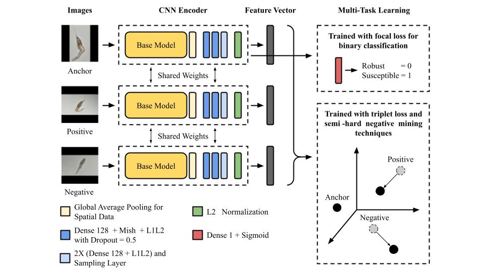
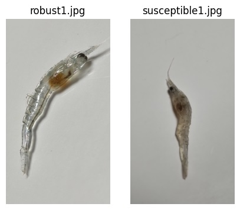
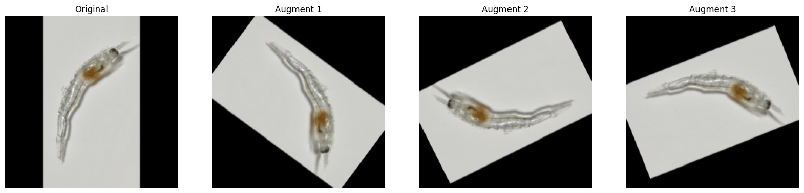

<p align="justify">
    <h1>VannameiVision</h1>
</p>

<p align="justify">
In aquaculture, early detection of susceptible shrimp larvae is of paramount importance to maintain healthy production environments. This repository introduces VannameiVision, a novel approach that combines probabilistic deep learning with transfer and deep metric learning techniques to address the challenge of accurately identifying shrimp larvae in such vulnerable conditions.
</p>



## Features

### Example data

<p align="justify">
We provide example data of robust and susceptible shrimp larvae (5 each).
</p>

```
from skimage import io
from vannameivision import *

import matplotlib.pyplot as plt

path = sorted(get_image_paths())

fig, (ax1, ax2) = plt.subplots(1, 2, figsize=(5, 5))
ax1.imshow(io.imread(path[0]))
ax1.set_title(path[0].split("/")[-1])
ax1.axis("off")
ax2.imshow(io.imread(path[5]))
ax2.set_title(path[5].split("/")[-1])
ax2.axis("off")
```



### Read and preprocess

<p align="justify">
    After reading the image, we apply these steps:
    <ul>
        <li>Log-scale adjustment</li>
        <li>Pad symmetrically to form a square</li>
        <li>Resize the image to 224x224</li>
        <li>Augment by random rotation between -360 and 360 degrees</li>
    </ul>
</p>

```
from skimage import io
from vannameivision import *

import matplotlib.pyplot as plt

path = sorted(get_image_paths())
path = path[0]

original = read_preprocess(path, augment=0)

preprocessed = read_preprocess(path, augment=15)

fig, (ax1, ax2, ax3, ax4) = plt.subplots(1, 4, figsize=(20, 5))
ax1.imshow(original)
ax1.set_title("Original")
ax1.axis("off")
ax2.imshow(preprocessed[0])
ax2.set_title("Augment 1")
ax2.axis("off")
ax3.imshow(preprocessed[1])
ax3.set_title("Augment 2")
ax3.axis("off")
ax4.imshow(preprocessed[2])
ax4.set_title("Augment 3")
ax4.axis("off")
```



### Predict robust/susceptible shrimp larvae

Use *robust1.jpg* as an example:

```
from vannameivision import *

model = build()

path = sorted(get_image_paths())
path = path[0]

image = read_preprocess(path, augment=15)

make_prediction(image, model, threshold=0.3)
```

```
# output
{"Prediction" : "Robust", "Confidence" : 100}
```

Use *susceptible1.jpg* as an example:

```
from vannameivision import *

model = build()

path = sorted(get_image_paths())
path = path[5]

image = read_preprocess(path, augment=15)

make_prediction(image, model, threshold=0.3)
```

```
# output
{"Prediction" : "Susceptible", "Confidence" : 100}
```

## Installation

<p align="justify">
Run this code to install:
</p>

```
pip install git+https://github.com/kobachii-d/vannameivision.git
```

## Citation

TBA

## Acknowledgements

<p align="justify">
We sincerely thank the <a href="https://www.biotec.or.th/" target="_blank">National Center for Genetic Engineering and Biotechnology (BIOTEC)</a>, <a href="https://pccp.ac.th/" target="_blank">Princess Chulabhorn Science High School Pathum Thani (PCSHS)</a>, and our families for their support and encouragement.
</p>
